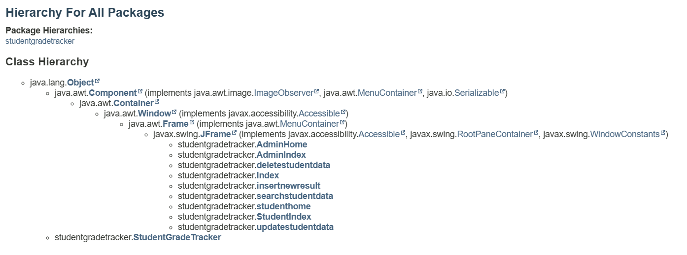

# Student Grade Tracker Tool

**Welcome to the Student Result Tracker System.**  
This application allows administrators to manage student records and results efficiently, 
while students can securely access their grades and performance details.

## Features
### Admin Functionality:
- **Insert**: Add new student records and results.
- **Update**: Modify existing records.
- **Delete**: Remove student records from the database.
- **Search**: Quickly locate student records by ID or name.

### Student Functionality:
- **Login**: Students can securely log in using their unique ID.
- **View Results**: Students can view their grades and performance uploaded by the admin.

## Technologies Used
- **Programming Language**: Java (JDK 21)
- **Database**: MySQL (using MySQL Workbench)
- **Libraries**:
  - `mysql-connector-j-8.3.0.jar` (for database connectivity)
  - `rs2xml.jar` (for displaying database tables in the GUI)
  - **JDBC** (for database interaction)

---

## Setup Instructions
### Prerequisites
1. **NetBeans IDE**: Download and install [NetBeans](https://netbeans.apache.org/).
2. **MySQL Workbench**: Install [MySQL Workbench](https://dev.mysql.com/downloads/workbench/) to manage your database.
3. **Required JAR Files**:
   - `mysql-connector-j-8.3.0.jar`
   - `rs2xml.jar`
4. **Java Development Kit (JDK 21)**: Ensure JDK 21 is installed and configured.

